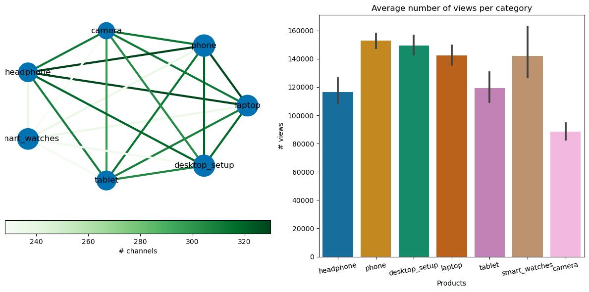
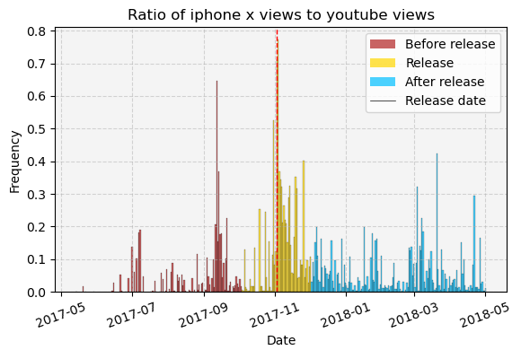
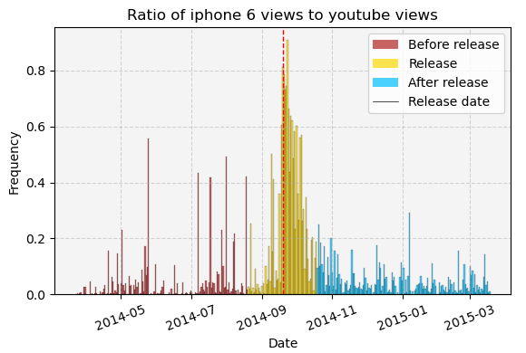
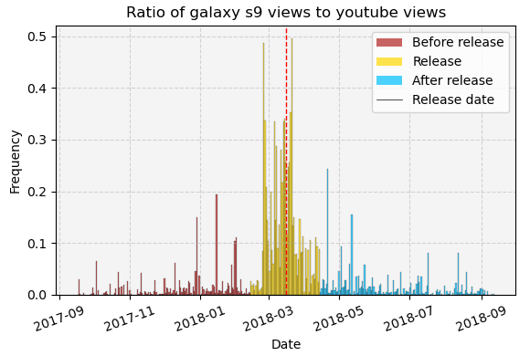
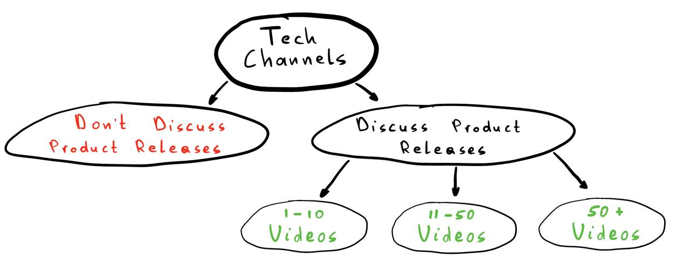
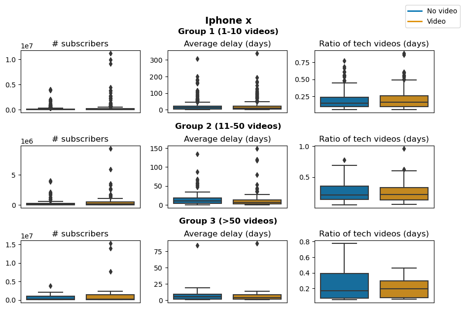
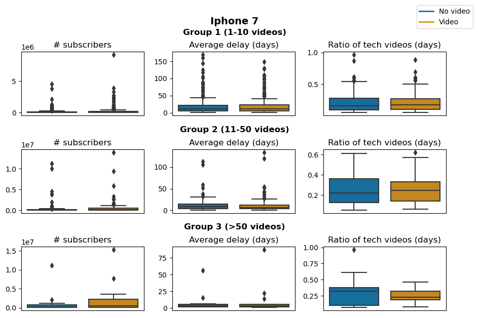
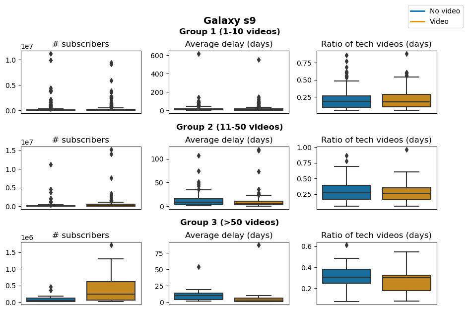

If you're interested in creating your own YouTube channel in the field of tech product reviews or are curious about how these channels gain attraction and evolve over time, you've made the right choice by clicking this link!

In this blog post, the Datasquad will cover everything you need to know about YouTube tech channels, from the types and range of products to review, to the timing of the release of videos, and even how to write your video titles to gain the most attraction!

All this is done through a very thorough analysis of the YouNiverse dataset, Large-Scale Channel, and Video Metadata from English-Speaking YouTube.

We conducted our analysis by first putting together hypotheses of how a successful tech channel operates, then we (dis)proved each of the hypotheses so that after reading this post, you go out with general guidelines that will help you in your YouTube journey.

## The Blog is structured in the following way:

#### Characteristics of successful Tech channels:
1. What is the ideal video duration for maximizing engagement?
2. How often should you release new content to optimize channel growth?
3. What impact does the type of reviewed product have on the growth of the channels?

#### Optimizing Viewership Through Video Titles:
1. Can the sentiment in your video title affect its view count?

#### Making the Most out of Product Release Dates:
1. Do product launch events significantly impact YouTubers?
2. What key topics should be addressed before, during, and after a product release?

# What should the duration of your videos be?

Have you ever wondered how the trend of a YouTube video’s length evolves through time? Does it have anything to do with the success of the video? And if we want to upload a video of what duration should it be? We try to get some insights on these questions by analyzing video durations.

In our analysis we split videos into 2 groups short to medium length videos (0-20 minutes) and medium to long videos (more than 20 minutes) as we suppose these are 2 significantly different video types.

### Videos of less than 20 minutes

The first basic thing to do is to see whether there exists a correlation between video durations and number of likes and dislikes.

**plots**

There is a relatively high positive correlation (that is decreasing across the years), but significant (p_value < 0.05) between the duration of a video and the number of likes it gets. Moreover, we see significant negative correlations in most years between # of dislikes and duration and so with longer videos the number of dislikes decreases. This can be explained by the fact that with longer videos on average, the video contains more content and so is more valuable/interesting and thus gets more likes and less dislikes.

Let's now see the trend of likes, dislikes, and duration over the years to take their evolution into consideration.

<iframe src="assets/plot/fig2.html" width="750px" height="530px" frameborder="0" position="relative">Plot</iframe>

We see from the above plots that both the number of dislikes and likes have been increasing across the years, potentially due to more users on the platform or more user engagement. We particularly note that the rate of increase of the number of likes is much higher than the one of dislikes as shown by the increasing ratio of like/dislike. This combined with the fact that the length of YouTube videos has been increasing over the years explains why we had higher correlation between duration and likes than we had with dislikes.

Let's now see how the video duration is related to user engagement. We do it by plotting the moving average of likes to dislikes ratio over the duration of a video.

<iframe src="assets/plot/fig3.html" width="700px" height="350px" frameborder="0" position="relative">Plot</iframe>

Wow!! See that huge drop around 600 seconds =10 minutes?? Is it by sheer luck?? Let’s dig deeper into this.

Our hypothesis is that the drop could be caused by an enormous number of 10min videos on YouTube that contain low quality content, as youtubers usually try to produce videos around this duration to benefit from more ads on their videos (YouTube has a video length threshold of 10 min past which youtubers get 2 ads on their videos and thus more money). Let’s try to prove this.

**plots**

First we make sure that the drop is not caused by the “moving” nature of the average. Indeed, we see that even by plotting the mean for each time interval (not 'moving') the drop is still there. Also, we notice that the number of likes decreased but the number of dislikes and number of videos stayed the same between the 10 min interval and the interval before it.

Let’s try to focus only on the 10 minute videos.

<iframe src="assets/plot/fig5.html" width="800px" height="710px" frameborder="0" position="relative">Plot</iframe>

hmm, interesting?? This looks like a power law. Could the drop be caused by outliers? Let’s  plot the median instead of the mean.

**plots**

Nope! The drop is still there.

What if we compute the sum ?

**plots**

We see from the above plot that the sum is decreasing from small duration to high duration (from the left time interval to the right time interval), but remember that the *number of videos* stayed the same for the 2 time intervals (480.2, 600] and (600, 719.8] which **explains the drop seen** when computing the mean (as we have the same denominator but a lower numerator: the like to dislike ratio is decreasing from small duration to high duration, whereas the number of videos has been decreasing from small duration to high duration **except** for the time interval of around 600 seconds = 10 minutes).

For the curious ones, further analysis on why the number of videos stayed the same for these 2 duration intervals can be found in our notebook.

### Videos of more than 20 minutes

Of course not all tech videos are less than 20 minutes, so now let's turn our attention to the videos of more than 20 minutes and apply the same analysis on them as we did above.

**plots**

The opposite effect is seen here compared to videos of less than 20 minutes. The longer the video the more dislikes it gets and the less likes it gets which makes sense as longer videos (longer than 20 minutes) tend to be boring/redundant.

**plots**

Similarly for this case, the number of dislikes and likes have been increasing across the years. However, here we see that the length of YouTube videos has been decreasing over the years, maybe hinting at the fact that youtubers noticed that longer videos bore people more and they thus went for shorter videos. Let's now see how the video duration is related to user engagement.

**plots**

Okay, we see that the ratio of likes to dislikes is fluctuating a lot for videos between 1200 seconds (20 min) and 10000 seconds (2.7 hours). Because this is a wide range, let's see how the videos spread out across this range and then break it down into smaller ranges and see what the videos are about in different smaller duration ranges.

**plots**

So now, let's see what the people are speaking about in the videos.

**plots**

As we can see from above, the videos between 20 and 60 minutes which account for (get the percentage of these videos from all long videos) of the videos, are still about the review of the tech products, but they are full and extended review video possibly broken into several parts, while the videos with duration above 1h are more from the release day live videos, that last for a couple of hours.

Putting it all together we can say that the best range for the duration of a video is between 16 min and 2.7 hours, however longer videos are usually meant for live videos from conferences. The main takeaway here is that we certainly want to avoid having really short videos in order to provide meaningful content to viewers and also avoid having really long videos so that we avoid boring them!

# How frequently should you upload?
As these tech channels jostle for attention in a crowded online space, specially in this field of tech reviews , one critical question arises: does the frequency of video uploads significantly influence their growth? And do they have to be very regular in terms of frequency to grow?

As regularity depends highly on the status of YouTubers, whether it's their full time activity, and how wide is their community, we decided to split the YouTubers into 8 categories, each of them representing a certain range where they lie:

- _0 - 10,000_  and  _10,000 - 50,000_   Very small YouTubers that often publish videos for fun and to their very small community.
- _50,000 - 100,000_ and _100,000 - 500,000_: YouTubers that start to have sponsors , and thus some obligations to be regular as it's starting to take most of their time.
- _500,000 - 1.000,000_ and _1.000,000 - 2.500,000_: Big YouTubers that start to have a big community, even fans, they usually do YouTube for a living and they win a lot through it.
- _2.500,000 - 5.000,000_ and _more_: very few YouTubers, known worldwide and being a reference as tech channels.

Let's first see their repartitions in this pie chart:

<iframe src="assets/plot/1_2_pie.html" width="750px" height="530px" frameborder="0" position="relative">Plot</iframe>

We can remark that more than half of them are small YouTubers, that almost a fifth are mid-range YouTubers, and that only around 6% of them are famous and have more than 500k subscribers. Our question then is , do you upload more frequency when you are famous? And more specifically, is the category in which you lie impacts your regularity?

To perform this analysis, we define the __regularity__ in the following way:

$$
\text{regularity} = n \cdot \log(1 + \frac{1}{\text{std}(f)})
$$
where $\text{n}$ is the number of videos uploaded within a month for a YouTuber, and $\text{f}$ = $\frac{1}{\text{delay}}$ where $\text{delay}$ is time in days between 2 consecutive videos.

This metric evaluates not just the frequency of video uploads on tech channels but also the consistency of their posting schedule. Channels that maintain a regular interval between video uploads gain a distinct advantage, highlighting the importance of a steady content rhythm. In contrast, channels with erratic schedules-such as releasing multiple videos on a single day followed by a prolonged period of inactivity—are less favored by this metric. Thus, while the overall quantity of content remains a key factor, the regularity and predictability of uploads emerge as crucial elements in driving channel growth.

And that is what we observe in this plot:

<iframe src="assets/plot/1_2_bars_1.html" width="750px" height="530px" frameborder="0" position="relative">Plot</iframe>

The main observation that we can do in this case, is that on average, the higher the category (and thus the number of subscribers), the higher the regularity is, and confidence intervals are not overlapping anywhere except within the first two categories that represent relatively small youtubers.

Now, we want to plot the moving average regularity and channels' growth to see if we can spot some clear relation between them:

<!-- Create the dropdown menu -->
<select onchange="showFrame2(this.value)" style="margin: 8px 0; width: 20%;">
  <option value="id_1">0-10k</option>
  <option value="id_2">10k-50k</option>
  <option value="id_3">50k-100k</option>
  <option value="id_4">100k-500k</option>
  <option value="id_5">500k-1M</option>
  <option value="id_6">1M-2.5M</option>
  <option value="id_7">2.5M-5M</option>
  <option value="id_8" selected>5M+</option>
</select>

<!-- Create the iframes -->
<iframe class="regularity_all" src="assets/plot/1_2_regularity_lines0-10k.html" width="750px" height="530px" frameborder="0" position="relative" id="id_1" style="display: none;">0-10k</iframe>
<iframe class="regularity_all" src="assets/plot/1_2_regularity_lines10k-50k.html" width="750px" height="530px" frameborder="0" position="relative" id="id_2" style="display: none;">10k-50k</iframe>
<iframe class="regularity_all" src="assets/plot/1_2_regularity_lines50k-100k.html" width="750px" height="530px" frameborder="0" position="relative" id="id_3" style="display: none;">50k-100k</iframe>
<iframe class="regularity_all" src="assets/plot/1_2_regularity_lines100k-500k.html" width="750px" height="530px" frameborder="0" position="relative" id="id_4" style="display: none;">100k-500k</iframe>
<iframe class="regularity_all" src="assets/plot/1_2_regularity_lines500k-1M.html" width="750px" height="530px" frameborder="0" position="relative" id="id_5" style="display: none;">500k-1M</iframe>
<iframe class="regularity_all" src="assets/plot/1_2_regularity_lines1M-2.5M.html" width="750px" height="530px" frameborder="0" position="relative" id="id_6" style="display: none;">1M-2.5M</iframe>
<iframe class="regularity_all" src="assets/plot/1_2_regularity_lines2.5M-5M.html" width="750px" height="530px" frameborder="0" position="relative" id="id_7" style="display: none;">2.5M-5M</iframe>
<iframe class="regularity_all" src="assets/plot/1_2_regularity_lines5M+.html" width="750px" height="530px" frameborder="0" position="relative" id="id_8" style="display: block;">5M+ Subscribers</iframe>

Across the spectrum, a consistent trend becomes apparent: channels that maintain a steady rhythm in their posting schedules generally see a more robust growth rate. This correlation holds true for most subscriber categories, with a notable exception in the 500,000 to 1,000,000 subscriber bracket.

For youtubers that have more than 5 000 0000 subscribers, we can observe that the growth rate fluctuates a lot, as they are only few youtubers within that category so it's more volatile, but despite the fluctuations, the trend is in overall similar to that of regularity.

Beyond these observations, a seasonal rhythm pulsates through almost all categories. In the end of the years (except for YouTubers between 500k- 1M subscribers) , a noticeable uptick in posting regularity is observed. This spike intriguingly aligns with the festive frenzy of Christmas, Thanksgiving, Black Friday, and major tech releases like video games and smartphones, including the much-anticipated iPhone launches. This seasonal phenomenon hints at a broader narrative, one that we will delve into with greater detail in Section 3 of our story.

Now, let's focus more on the group 4 (500k-1M subs), that has been problematic during the previous analysis:

- We first select all the channels that have been in this range at some point of time during this period and let's check how does the subscribers growth rate evolves depending on the regularity bin.

<iframe src="assets/plot/1_2_bars_2.html" width="750px" height="530px" frameborder="0" position="relative">Plot</iframe>

From the above plot we can see that the higher regularities are more correlated with the growth rate. So now, let's seperate those channels into 2 at regularity above and below 32, and see what's happening more in detail for those two subgroups, using the same time series comparison that we have done before. 

<!-- Create the dropdown menu -->
<select onchange="showFrame1(this.value)" style="margin: 8px 0; width: 20%;">
  <option value="positive" selected>Above 32</option>
  <option value="negative">Below 32</option>
</select>

<!-- Create the iframes -->
<iframe class="regularity_range" src="assets/plot/1_2_regularity_lines_range_4_0.html" width="750px" height="530px" frameborder="0" position="relative" id="positive" style="display: block;">Regularity above 32</iframe>
<iframe class="regularity_range" src="assets/plot/1_2_regularity_lines_range_4_1.html" width="750px" height="530px" frameborder="0" position="relative" id="negative" style="display: none;">Regularity below 32</iframe>

From the plots above, we can observe that for channels reaching a regularity above 32, over the 3-year period we analyzed, there is a high correlation between growth rate and regularity (they closely track each other for most of the period). This suggests that for YouTubers with 500k to 1M subscribers, once they reach the regularity of above 32, they should try to sustain the pace of frequency, as slowing the frequency may result in a decrease in the growth as well, as they are closely related at that point.

Additionally, when calculating the average number of videos per month for YouTubers who achieved a regularity of 32 or more, we find that this corresponds to nearly 33 videos per month, or about one video per day.

The main conclusion for this question is that, in general, high regularity (i.e., a consistent and frequent video upload rate with low volatility) is associated with greater success and a higher growth rate. Even in some problematic categories where the correlation is generally unclear, very high regularity still correlates with a high growth rate.

However, if you are a YouTuber with 500k to 1M subscribers and have chosen to maintain high regularity to accelerate growth, it's important to note that you should sustain this pace to preserve this growth rate, as reducing the frequency will likely lead to a decreased growth rate.

# What impact does the type of reviewed product have on the growth of the channels?

In this section, we are going to focus on the types of review products. More specifically, we want to understand what types of tech products have a higher influence to the growth of our channel, or does it even matter at all? We take the following 7 video types and see their effect:

<table style="border: 1px solid black; width: 100%; text-align: center;">
  <tr>
    <td style="width: 14.28%; text-align: center;">Laptop</td>
    <td style="width: 14.28%; text-align: center;">Phone</td>
    <td style="width: 14.28%; text-align: center;">Camera</td>
    <td style="width: 14.28%; text-align: center;">Headphone</td>
    <td style="width: 14.28%; text-align: center;">Smart Watch</td>
    <td style="width: 14.28%; text-align: center;">Tablet</td>
    <td style="width: 14.28%; text-align: center;">Desktop Setup</td>
  </tr>
</table>

Let's first see which product types are more common among the YouTubers:

<iframe src="assets/plot/1_3_timeseries.html" width="750px" height="530px" frameborder="0" position="relative">Plot</iframe>

As we can see, most channels tend to focus on phones. It just means phones are a common topic to focus on, but we still need to see (in the next sub-section) how it actually influences the channel's growth.

Now, we will answer the following sub-questions:
- What range of product types should YouTubers should review?
- Which product categories have higher influence on the channels growth?
- Which product categories attract more viewers?

### What range of product types should YouTubers should review?

Below, we analyze the effect of covering a wider range of products, on the number of subscribers, a narrow range of products. To ensure the accuracy of our analysis, and to remove the effect of any possible confounder, we have balanced these 2 groups (wide, narrow) on some metrics, namely average duration of videos per channel, and the delay in time between publishing 2 sequential videos. Having a balanced dataset, let's now see the density of these 2 groups across the number of subscribers and the total views metrics.

<!-- Create the dropdown menu -->
<select onchange="showFrame3(this.value)" style="margin: 8px 0; width: 20%;">
  <option value="id_1_dist" selected>Subscribers</option>
  <option value="id_2_dist">Views</option>
</select>

<!-- Create the iframes -->
<iframe class="1_3_dist" src="assets/plot/1_3_distribution_susb.html" width="750px" height="530px" frameborder="0" position="relative" id="id_1_dist" style="display: block;">Subscribers</iframe>
<iframe class="1_3_dist" src="assets/plot/1_3_distribution_views.html" width="750px" height="530px" frameborder="0" position="relative" id="id_2_dist" style="display: none;">Views</iframe>

From the above distribution of 'narrow' and 'wide' channels, we can see that non of the 2 groups is clearly outperforming the other. We can also confirm it more statistically. In fact, when we compute the statistical difference between them we get the following results:

<table style="border: 1px solid black; width: 50%; text-align: center;margin-left: auto; margin-right: auto;">
  <tr>
    <th></th>
    <th style="text-align: center;"># Subscribers</th>
    <th style="text-align: center;"># Views</th>
  </tr>
  <tr>
    <td>P-value</td>
    <td style="text-align: center;">0.65</td>
    <td style="text-align: center;">0.88</td>
  </tr>
</table>

Being both pvalues larger than 0.05, it further confirms that whether or not a channel focuses on a single product review, or covers a wider range of products, it does not have a direct influence on the growth of the channel, i.e. number of subscribers/views.

### Which product categores have higher influence on the channels growth?

Ok, we found out that it is all up to us whether to focus on a single product or cover a wider range. Now the question is which products combination I can go with if I choose to cover several product types. To answer this question, here, we only fitler the top channels that focus on wider range of product types and see which ones of the product categories usually go together and bring them more views. For doing that we can make use of graphs for the sake of visualization as follows:

We can read the above graph as follows:

- nodes - product categories
- nodes size - average number of views of that category
- edge color - number of channels that have uploaded both of the corresponding products

By doing that we can see that the videos about _phones_, _headphones_ and _laptops_ have stronger bond compared to the other pairs, meaning most of the successful channels tend to cover the combination of these products.

### Which product categories attract more viewers?
Now, we know the secret combination of the tech products, but does that mean these are the only 3 products that go successful? Let's find it out!

For each video uploaded, let's get the ratio of the number of views of the video to the total number of views of the channel at the time of release of the video. Then, we want to see if any one of the products have a clearly higher ratio of views compared to the others. The reason why we are diving the number of views by the total number of views of the channel at the time of the release is to remove the influence of the current popularity of the channel.

<iframe src="assets/plot/1_3_bars.html" width="750px" height="530px" frameborder="0" position="relative">Plot</iframe>

Here, we can see that no single product is totally outperforming the other. However it is worth mentioning that the _phones_ tend to attract more viewers compared to the _camera_ and _smart watches_.

In summary, we can draw the following conclusions:
There isn't a significant statistical difference in the number of subscribers and total views between channels focusing on specific tech products and those covering a broader range. This implies that the diversity of reviewed product types doesn't noticeably impact the growth of the channels.
Among the successful channels covering a wide range of tech products, the ones that attract more viewers are Phones, Desktop setup, Laptop, and Headphones, in that order of importance. Successful channels often produce videos featuring a combination of Phones, Laptop, and Headphones.

# Does the sentiment of the title have an impact on the views of the video?

Here, we want to see the influence of titles sentiment on attracting the viewers. We choose the number of views as our metric, as a title is intended to attract users to click on our video.

First, we select the videos that got up to 100,000 views as we are targeting new/small channels. Then we select the top 10% as we want to analyse the characteristics of the best performing videos. To assess the "success" of a video, we also divide the number of views by the number of subscribers of the corresponding channels to remove the influence of the channel's popularity. Finally, this is the distribution of the sentiment of the titles calculated in 2 methods:

<iframe src="assets/plot/2_1_distribution.html" width="750px" height="530px" frameborder="0" position="relative">Plot</iframe>

Both methods indeed confirm that the density of the positive titles is higher compared to the negative ones, however we observe that most of the "top videos" have neutral titles. We, now, want to see the correlation between views and sentiment more statistically using an ols regression and come up with the following results:

$$ Y = 0.56 + 0.09 \cdot S_1 $$
$$ Y = 0.55 + 0.18 \cdot S_2 $$

with the following likelihood: 

<table style="border: 1px solid black; width: 50%; text-align: center;margin-left: auto; margin-right: auto;">
    <tr>
        <th></th>
        <th style="text-align: center;">Coefficient</th>
        <th style="text-align: center;">P-value</th>
    </tr>
    <tr>
        <td style="text-align: center;">Constant</td>
        <td style="text-align: center;">0.56</td>
        <td style="text-align: center;">0</td>
    </tr>
    <tr>
        <td style="text-align: center;">S1</td>
        <td style="text-align: center;">0.09</td>
        <td style="text-align: center;">0.005</td>
    </tr>
    <tr>
        <td style="text-align: center;">Constant</td>
        <td style="text-align: center;">0.55</td>
        <td style="text-align: center;">0</td>
    </tr>
    <tr>
        <td style="text-align: center;">S2</td>
        <td style="text-align: center;">0.18</td>
        <td style="text-align: center;">0</td>
    </tr>
</table>

where $Y$ is the ratio of the number of views of a video to the number of subscribers of the corresponding channel, $S_1$ and $S_2$ are the above 2 methods of calculating the sentiment respectively.

In the first scenario, although the impact of positive sentiments on the average views isn't very large, it still matters because it is statistically significant (the likelihood of it happening by chance is less than 5%). Now, in the second case, things get more interesting. Not only is the influence of positive sentiments quite substantial, but it's also statistically significant. This implies that using positive language in titles can boost the number of views by up to a third compared to titles with neutral language. In simpler terms, having a positive title increases the likelihood of attracting more viewers.

_However, it's important to understand that the observed correlation doesn't necessarily mean there's a direct cause-and-effect relationship. Another factor to consider is the video thumbnail, which could be influencing the results. Unfortunately, we don't have control over the thumbnail, and it might be acting as a confounding variable, affecting the relationship we see between positive sentiments in titles and increased views._

# Do product launch events significantly impact YouTubers?

We're exploring whether discussing the launch of a tech product on a channel affects its popularity. Does creating content around the release of a tech gadget increase the number of views and subscribers? How does making videos about a specific product during its launch period impact the overall growth of a channel?

To better realise the importance of our investigation, let’s take a closer look at the influence some product launch dates have on the YouTube platform. Below, we suggest some plots that show the ratio of views directly gathered by a specific product to the views on the whole of the YouTube tech community for each given day.

<!-- Create the dropdown menu -->
<select onchange="showFrame6(this.value)" style="margin: 8px 0; width: 20%;">
  <option value="id_1_rel" selected>iPhone X</option>
  <option value="id_2_rel">iPhone 6</option>
  <option value="id_3_rel">Galaxy S9</option>
</select>

<!-- Create the images -->

As you can see from the above histograms, tech giants certainly gain a lot of attention when there is a new release nearby, in fact we see that for the iPhone 6 and iPhone X, the ratio was almost of 0.8 meaning that 80% of the views during the release day of those specific products were directed towards videos about the iPhone 6 and X respectively.
We also see that there are some moments where viewers show interest before the release of the product. It would be interesting to dig deeper into what topics are discussed during this period, which is what we do in the next section.
We can thus sat that, since we see a massive interest in the products near their release date, it is in the youtuber’s advantage to discuss topics related to the product near its release date. Now let's prove this more analytically;

For our investigation, we've chosen the following three items: 

<table style="border: 1px solid black; width: 100%; text-align: center;">
  <tr>
    <td style="width: 33.3%; text-align: center;">iPhone X</td>
    <td style="width: 33.3%; text-align: center;">iPhone 7</td>
    <td style="width: 33.3%; text-align: center;">Galaxy S9</td>
  </tr>
</table>

We've categorized tech channels into two groups: those that discuss product releases and those that don't. To assess the trends in channel growth, we're comparing data over one year, examining the six months before and after each product release. Additionally, for each item, among the channels discussing its release, we've further divided them into three groups based on the number of videos they have related to the product: channels with 1 to 10 videos, those with 11 to 50 videos, and those with more than 50 videos. This approach allows us to analyze how different levels of content creation about a product release correlate with channel growth.

So here is the division structure to keep it visual:

Before we compare two groups, we want to make sure they are fair and balanced. We're looking at factors like the number of subscribers, how often videos are uploaded, and the proportion of tech review videos in each group. This is important because things like the number of subscribers and the ratio of tech videos could potentially influence the channel's growth, and we want to account for that.

<!-- Create the buttons -->

  <button onclick="showFrame4('id_1_bal')">iPhone X</button>
  <button onclick="showFrame4('id_2_bal')">iPhone 7</button>
  <button onclick="showFrame4('id_3_bal')">Galaxy S9</button>

<!-- Create the images -->

We carefully balanced our groups, and as we can see from the results Group 1 and Group 2 are well-balanced, but Group 3, with fewer channels, is less ideal. Despite the limitations in Group 3, our analysis draws meaningful conclusions from the well-matched Group 1 and Group 2.

Now, we're exploring how the monthly _Growth Rate_ of new subscribers compares to the total number of subscribers over a one-year span (more specifically defined as $ \frac{\text{\# monthly new subscribers}}{\text{\# total subscribers}} $). We're looking at a period that spans 3 months before and after our analysis perdiod, totaling 1 year around the product release date.

<!-- Create the buttons -->

  <button onclick="showFrame5('id_1_ts')">iPhone X</button>
  <button onclick="showFrame5('id_2_ts')">iPhone 7</button>
  <button onclick="showFrame5('id_3_ts')">Galaxy S9</button>

<!-- Create the iframes -->
<iframe class="3_1_timeseries" src="assets/plot/3_1_timeseries_iphone_x.html" width="750px" height="530px" frameborder="0" position="relative" id="id_1_ts" style="display: block;">Subscribers</iframe>
<iframe class="3_1_timeseries" src="assets/plot/3_1_timeseries_iphone_7.html" width="750px" height="530px" frameborder="0" position="relative" id="id_2_ts" style="display: none;">Views</iframe>
<iframe class="3_1_timeseries" src="assets/plot/3_1_timeseries_galaxy_s9.html" width="750px" height="530px" frameborder="0" position="relative" id="id_3_ts" style="display: none;">Views</iframe>

_where the green line marks the day a product is released. Alongside it, two red lines span a six-month stretch. This is the perdiod during which if a channel talked about the product, we consider it "discussed";_

Talking about the iPhone X, we observed that channels creating videos about it in the six-month period experienced some growth in their channel's _Growth Rate_. Conversely, channels that didn't discuss it didn't show any major changes in their trend. This difference is more noticeable, especially among channels with 1-50 videos about the iPhone X. Regarding the 3rd Group, we did notice a slight spark, but we can't rely heavily on this group due to the very few number of channels in it.

_So, let's focus mostly on the channels in Groups 1 and 2._

Something interesting is happening in Group 2 of where the iPhone 7 – both channels are increasing. Let's explore this further. We got even more curious and decided to uncover what these videos are really about.

Oh, it is not about iPhone 7 anymore. Hold on, let's see what other products hit the market during this time!

<table style="border: 1px solid black; width: 70%; text-align: center; margin-left: auto; margin-right: auto;">
    <tr>
        <th style="text-align: center;">Phone Name</th>
        <th style="text-align: center;">Release Date</th>
    </tr>
    <tr>
        <td style="text-align: center;">Redmi Note 4G</td>
        <td style="text-align: center;">August 2014</td>
    </tr>
    <tr>
        <td style="text-align: center;">Redmi Note 4X</td>
        <td style="text-align: center;">February 2017</td>
    </tr>
    <tr>
        <td style="text-align: center;">Redmi Note 3 Pro Prime</td>
        <td style="text-align: center;">January 2016</td>
    </tr>
    <tr>
        <td style="text-align: center;">Redmi Note 3</td>
        <td style="text-align: center;">Novembre 2015</td>
    </tr>
    <tr>
        <td style="text-align: center;">Xiaomi Redmi 3S Prime</td>
        <td style="text-align: center;">August 2016</td>
    </tr>
    <tr>
        <td style="text-align: center;">Xiaomi Redmi 3S</td>
        <td style="text-align: center;">June 2016</td>
    </tr>
    <tr>
        <td style="text-align: center;">Xiaomi Redmi 4</td>
        <td style="text-align: center;">November, 2016</td>
    </tr>
    <tr>
        <td style="text-align: center;">Xiaomi Mi 5s</td>
        <td style="text-align: center;">September 2016 </td>
    </tr>
    <tr>
        <td style="text-align: center;">Xiaomi Mi 5s Plus</td>
        <td style="text-align: center;">September 2016</td>
    </tr>
    <tr>
        <td style="text-align: center;">Xiaomi Redmi Note 4 Plus</td>
        <td style="text-align: center;">August 2016</td>
    </tr>
    <tr>
        <td style="text-align: center;">Samsung Galaxy A5 (2016)</td>
        <td style="text-align: center;">December 2014</td>
    </tr>
    <tr>
        <td style="text-align: center;">Samsung Galaxy J5 (2016)</td>
        <td style="text-align: center;">April 2016</td>
    </tr>
    <tr>
        <td style="text-align: center;">Samsung Galaxy J7 (2016)</td>
        <td style="text-align: center;">April 2016</td>
    </tr>
    <tr>
        <td style="text-align: center;">Samsung Galaxy Grand Prime Plus</td>
        <td style="text-align: center;">November 2016</td>
    </tr>
    <tr>
        <td style="text-align: center;">Samsung Galaxy C5 Pro</td>
        <td style="text-align: center;">March 2017</td>
    </tr>
    <tr>
        <td style="text-align: center;">Samsung Galaxy J7 Nxt</td>
        <td style="text-align: center;">July 2017</td>
    </tr>
    <tr>
        <td style="text-align: center;">Samsung Galaxy C7 Pro</td>
        <td style="text-align: center;">February 2017</td>
    </tr>
    <tr>
        <td style="text-align: center;">Samsung Galaxy A7 (2016)</td>
        <td style="text-align: center;">December 2015</td>
    </tr>
</table>

Ah, now it makes sense! Turns out, there were lots of videos about other cool tech stuff during this period, i.e. from Xiaomi and Samsung. That's why even the channels that didn't talk about the iPhone 7 release saw an increase in their overall growth. It's like everyone was buzzing about tech goodness! 

But is it only for iPhone 7? Let's us give it a check and do the same analysis for the 2nd Group of Galaxy S9 as well, for example. Let's see what the videos were mostly about:

and again these are the products released during our analysis period:

<table style="border: 1px solid black; width: 70%; text-align: center; margin-left: auto; margin-right: auto;">
    <tr>
        <th style="text-align: center;">Phone Name</th>
        <th style="text-align: center;">Release Date</th>
    </tr>
    <tr>
        <td style="text-align: center;">Samsung Galaxy A8 (2018)</td>
        <td style="text-align: center;">December 2017</td>
    </tr>
    <tr>
        <td style="text-align: center;">Samsung Galaxy A8+ (2018)</td>
        <td style="text-align: center;">December 2017</td>
    </tr>
    <tr>
        <td style="text-align: center;">Samsung Galaxy J6+</td>
        <td style="text-align: center;">September 2018</td>
    </tr>
    <tr>
        <td style="text-align: center;">Xiaomi Mi 8</td>
        <td style="text-align: center;">May 2018</td>
    </tr>
    <tr>
        <td style="text-align: center;">Xiaomi Mi 8 Pro</td>
        <td style="text-align: center;">September 2018</td>
    </tr>
    <tr>
        <td style="text-align: center;">...</td>
        <td style="text-align: center;">...</td>
    </tr>
</table>

Indeed we again see a similar result for this group as well.

In looking at all our findings, here's what we've figured out: When we focus on a specific product, we tend to see one of two things happening:

- __Clear Gains:__ Some channels experience a noticeable increase in views and subscribers, showing an uptick in their trend rate between the two red lines. Meanwhile, the other group doesn't see the same boost.

- __No Clear Gains:__ In some cases, there's no clear gain. After digging a bit deeper, it seems this happens when the release of the item we're focusing on overlaps with releases from other products that the control channels discuss. Both channels see a trend rate increase, but for different reasons—the impact of the considered item gets somewhat "hidden" amid the simultaneous release of other items.

Moreover, we've noticed that the curves for the number of views and subscribers usually follow a similar shape within a given item, group, and type of channel.

In a nutshell, it's not just the big tech brands like iPhone and Galaxy; it turns out most tech product releases create a golden opportunity to amp up channel growth by sharing videos about them.

_Let's now turn our attention to the topics discussed in those videos at different time periods ..._

# What key topics should be addressed before, during, and after a product release?

Now that we have general guidelines about how to upload videos about a given tech product near its release date, we need to know what topics to discuss and when. The following section will answer this question. Now, let's see what are the topics discussed before and during the release period:

<!-- Create the dropdown menu -->
<select onchange="showFrame7(this.value)" style="margin: 8px 0; width: 20%;">
  <option value="id_1_lda" selected>Before Release</option>
  <option value="id_2_lda">During Release</option>
</select>

<!-- Create the iframes -->
<iframe class="3_2_lda" src="assets/plot/3_2_lda_1.html" width="750px" height="530px" frameborder="0" position="relative" id="id_1_lda" style="display: block;">Before Release</iframe>
<iframe class="3_2_lda" src="assets/plot/3_2_lda_2.html" width="750px" height="530px" frameborder="0" position="relative" id="id_2_lda" style="display: none;">During Release</iframe>

We notice that the content discussed before a product release is quite distinct from what's covered during the actual release.

Before the big launch, videos tend to focus on:

- Leaking information about the upcoming product, in this case, the iPhone X.
- Unboxing of potential clones or prototype versions of the iPhone X.
- Speculating about the possible features the iPhone X might have.

Once the product is officially out, the videos shift gears and delve into:

- Unboxing the real deal, the iPhone X itself.
- Offering detailed reviews of the iPhone X.
- Comparing the iPhone X with other smartphones on the market.
- Testing various features of the iPhone X, such as the camera, screen, battery, and more.

Now all of this is great, but we didn't really see how videos about those specific topics impacted the overall channel growth. Let's see the growth of those channels that were publishing videos in the pre-release period. We can measure it with trend rate 3 metrices: ratio of new subscribers to the total number of subscribers, ratio of new views to the total number of views, and the number of subscribers itself:

<!-- Create the dropdown menu -->
<select onchange="showFrame8(this.value)" style="margin: 8px 0; width: 20%;">
  <option value="id_2_timeseries" selected>Ratio Subs</option>
  <option value="id_3_timeseries">Ratio Views</option>
</select>

<!-- Create the iframes -->
<iframe class="3_2_timeseries" src="assets/plot/3_2_time_ratio_subs.html" width="750px" height="530px" frameborder="0" position="relative" id="id_2_timeseries" style="display: block;">Ratio Subs</iframe>
<iframe class="3_2_timeseries" src="assets/plot/3_2_time_ratio_views.html" width="750px" height="530px" frameborder="0" position="relative" id="id_3_timeseries" style="display: none;">Ratio Views</iframe>

It's evident that the channels talking about a product before its release experience growth well before the actual launch. What's intriguing is that they not only attract subscribers leading up to the release but also manage to retain those subscribers even after the product hits the market. It's like building anticipation pays off in long-term support!
